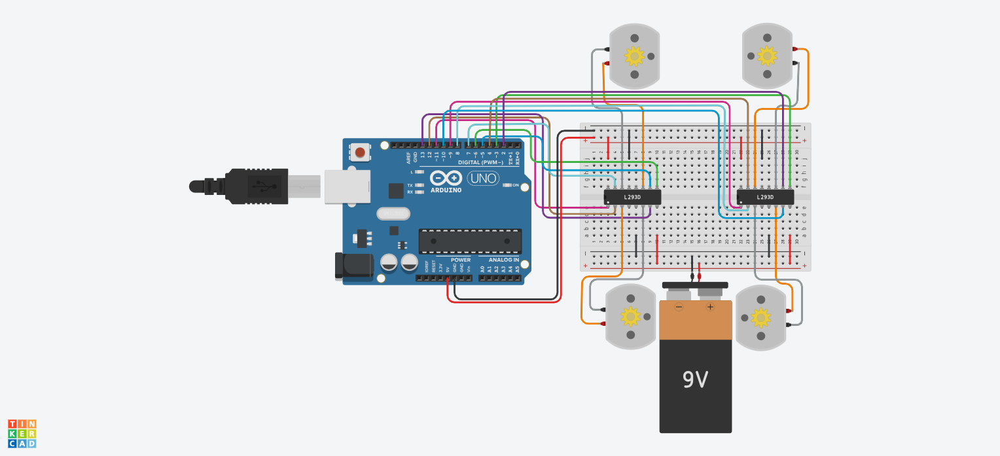

# 4-DC-Motor-Motion-Simulation 

A simulation project for controlling four DC motors using Arduino and an L293D motor driver.

The project simulates the motion of a four-wheel vehicle-like platform. The motors are controlled according to their position (right and left sides) to achieve realistic forward, backward, and turning movements.

## Project Overview

Instead of treating the four DC motors as independent motors, they are arranged as a four-wheel system similar to a vehicle or mobile robot.

The movement logic depends on controlling the motors based on their sides:

   Front 

M2        M1
  
M4        M3
  
   Back
  
Motor distribution:
- Right side:
  - M1
  - M3
- Left side:
  - M2
  - M4
## Motor Orientation Adjustment

Since the DC motors are mounted on opposite sides of the four-wheel platform, their physical orientations are different.

To achieve consistent vehicle-like movement, the polarity of some motors was reversed during wiring. This ensures that when the same forward command is applied, all wheels rotate in the correct direction for forward motion.

This approach keeps the software control logic simple while matching the real mechanical arrangement of a mobile platform.

## Components

- Arduino Uno
- 2 × L293D Motor Driver
- 4 × DC Motors
- Tinkercad Simulation

## Motor Control

Each motor is connected to the L293D driver using:

- IN1 and IN2: Control the motor direction.
- EN (Enable): Controls motor activation and speed using PWM.

The direction is controlled by changing the input states:
- `IN1 = HIGH` and `IN2 = LOW` → Forward movement
- `IN1 = LOW` and `IN2 = HIGH` → Backward movement
- `IN1 = LOW` and `IN2 = LOW` → Motor stop

## Movement Implementation

### Forward Movement

All four motors rotate in the forward direction, allowing the platform to move straight forward.

---

### Backward Movement

The motor directions are reversed, causing the platform to move backward.

---

### Right and Left Movement

To simulate turning, the motors are controlled according to their sides.

### Turning Right

The left-side motors move while the right-side motors stop. This makes the platform move toward the right direction.

---

### Turning Left

The right-side motors move while the left-side motors stop. This makes the platform move toward the left direction.

## Simulation Sequence

The simulation follows this sequence:

1. Move forward for 30 seconds.
2. Move backward for 60 seconds.
3. Alternate between right and left movements for 60 seconds.

## Simulation Demo

### Tinkercad Design

### Video Demonstration

https://github.com/user-attachments/assets/b6f99689-d2e5-4a72-bb11-9206fda4028c

### Tinkercad Link

https://www.tinkercad.com/things/gYw5IwY7rhT-4-dc-motor-simulation?sharecode=smyOfyoW49kAelKsMVVNcxwIX3H9gryZwVjXYnPfaZ4
